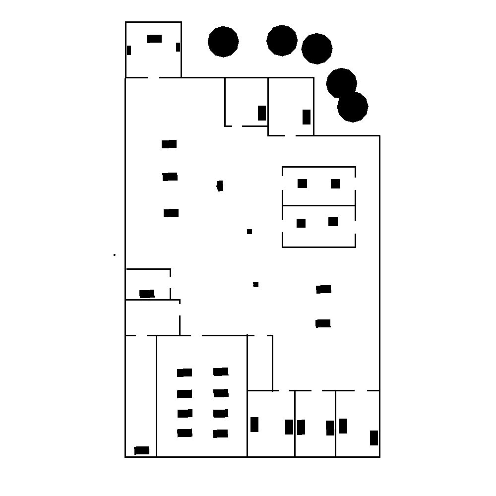
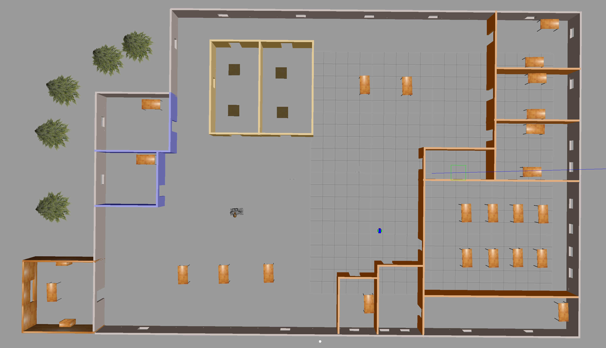
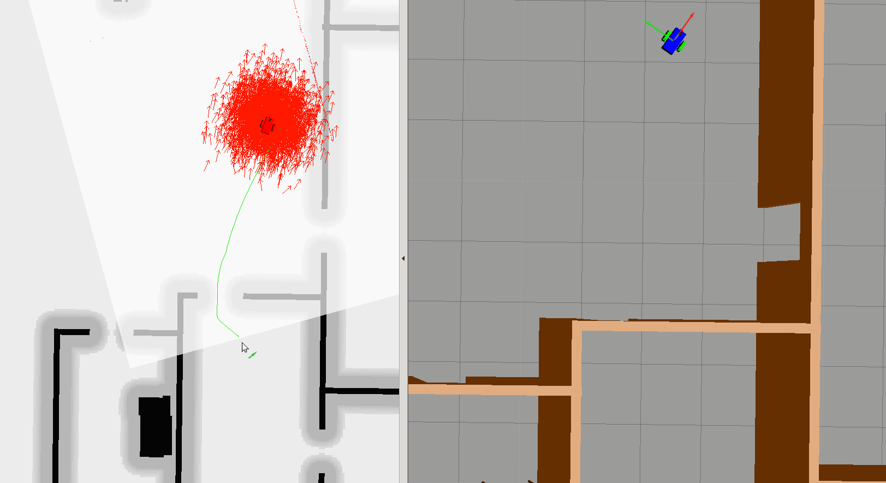

# Project 3

In this project, the robot is localizing itself using adaptative monte carlo localization algorithm (AMCL), and uses the `move_base` node to find a path to a target that uses the localization data.

## Move base node

This project uses the `move_base` package in which you can define a navigation goal position for your robot in the map, and the robot will navigate to that goal position. Note that this step is optional if you choose to use teleop node to control and localize your robot.

The `move_base` package is a very powerful tool. It utilizes a costmap - where each part of the map is divided into which area is occupied, like walls or obstacles, and which area is unoccupied. As the robot moves around, a local costmap, in relation to the global costmap, keeps getting updated allowing the package to define a continuous path for the robot to move along.

What makes this package more remarkable is that it has some built-in corrective behaviors or maneuvers. Based on specific conditions, like detecting a particular obstacle or if the robot is stuck, it will navigate the robot around the obstacle or rotate the robot till it finds a clear path ahead.

Parameters for this package are setup in the `move_base` node of the `launch/amcl.launch` file, and reference config files in `my_robot/config`

## AMCL node
The amcl node takes odometry and laser scan data to perform the AMCL localization. The config is in the `amcl` node of the `launch/amcl.launch` file

## Map server Node
[The map_server node](http://wiki.ros.org/map_server) provides map data as a ROS service to other nodes such as the `amcl` node. It uses the map saved in `my_robot/maps/myworld.pgm`. The corresponding yml file in the same folder provides metadata about the map which is loaded in the map server node in `launch/amcl.launch`

## Teleop package
The [teleop package](https://github.com/ros-teleop/teleop_twist_keyboard) can be used to control the robot using the keyboard.

After running `catkin_make && source devel/setup.bash`, you can run it with `rosrun teleop_twist_keyboard teleop_twist_keyboard.py` and it will then accept keyboard input to move the robot.

## Creating the map
Generate the map from the Gazebo world directly using the ROS package [pgm_map_creator](https://github.com/udacity/pgm_map_creator)

The map ROS AMCL Package uses is a pgm file. A pgm file is a grayscale image file

By default, AMCL package will treat 'darker' pixels as obstacle in the pgm map file, and 'lighter' pixels as free space. The threshold could be set as a parameter which we will cover when we are building the launch file.

The map package needs `sudo apt-get install libignition-math2-dev protobuf-compiler`

Doing a git clone of `git clone https://github.com/udacity/pgm_map_creator.git` inside the catkin_ws and then copying the world to the `src/pgm_map_creator/world/`, and adding `<plugin filename="libcollision_map_creator.so" name="collision_map_creator"/>` to the world file allows the plugin to generate the map.

Run `catkin_make` to build the project.

Then run `gzserver src/pgm_map_creator/world/<YOUR GAZEBO WORLD FILE>`

Then in a second terminal run `roslaunch pgm_map_creator request_publisher.launch`

## MCL algorithm

Monte carlo localisation (MCL) is a localization algorithm that uses particles to estimate the robot's position. It works with the following high level steps:

* Get the previous belief on the robot's location. Which initially is a set of particles selected at random.
* Update the position of each particles using the motion information such as the odometer
* Fetch sensor data and assign a weight on each particles given that new information.
* Resample by keeping the particles with high probability
* Output the new belief
* Repeat

## Run AMCL

First compile the project using `catkin_ws` and `source devel/setup.bash`, then run in two terminals:
* `roslaunch my_robot amcl.launch`
* `roslaunch my_robot world.launch`

## Results

The robot can improve its initial estimate to find its way on the map.

