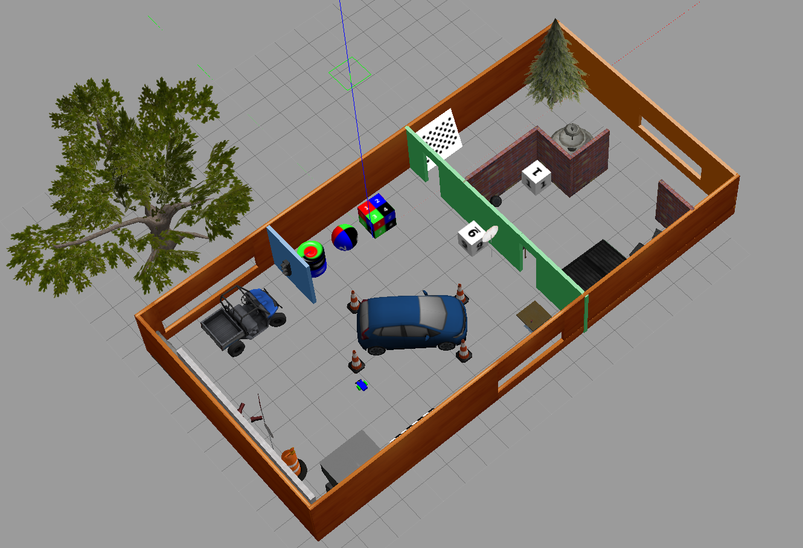
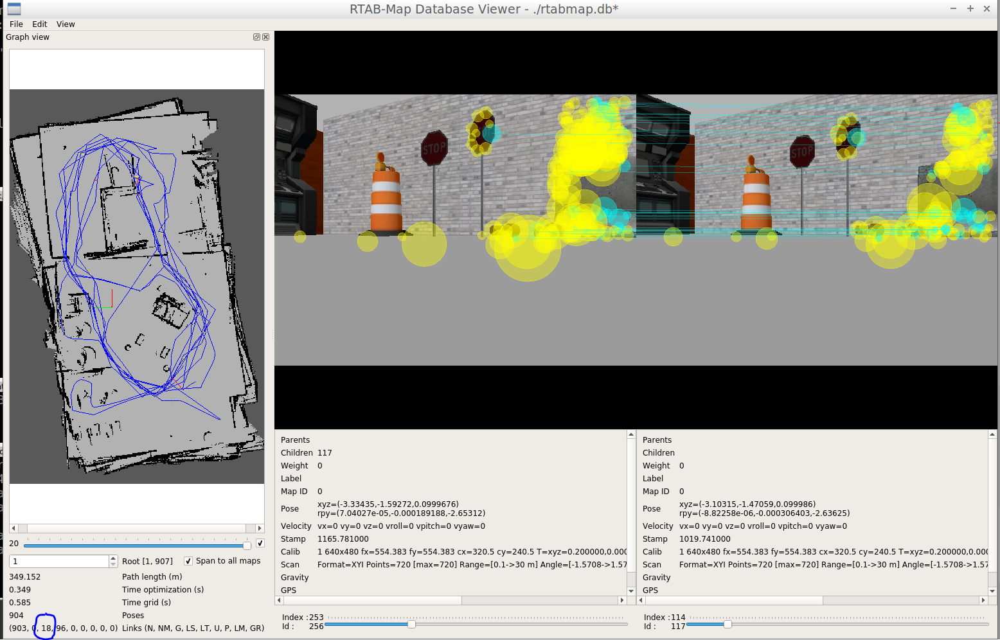

You must install the rtabmap package: `sudo apt-get install ros-kinetic-rtabmap-ros`

# Project 4

In this project, the robot is using rtab map to localize and map its environment at the same time.

## Running the project

Place `my_robot` in `catkin_ws/src` then run `catkin_make` and `source ./devel/setup.bash`
To create the map, run the following (after building in the `catkin_ws` folder)

* `roslaunch my_robot world.launch`
* `roslaunch my_robot teleop.launch`: this will allow you to control the robot using the keyboard
* For mapping: `roslaunch my_robot mapping.launch`: Drive the robot around and generate the rtabmap.db file
* For localisation: `roslaunch my_robot localization.lauch`: Localize the robot using the map generated in the mapping step. The rtabmap.db file must be in the `maps` folder.

* To visualize the content of the map, use `rtabmap-databaseViewer ./maps/rtabmap.db`, accept the settings and then select the graph view.

## The world

## Creating the map

To generate the map, we want as many global loop closures as possible. Drive the robot around multiple times in the same place to have these loop closures.

Circled in the image below is the number of global loop closures I obtained and the corresponding map after driving around the world.

