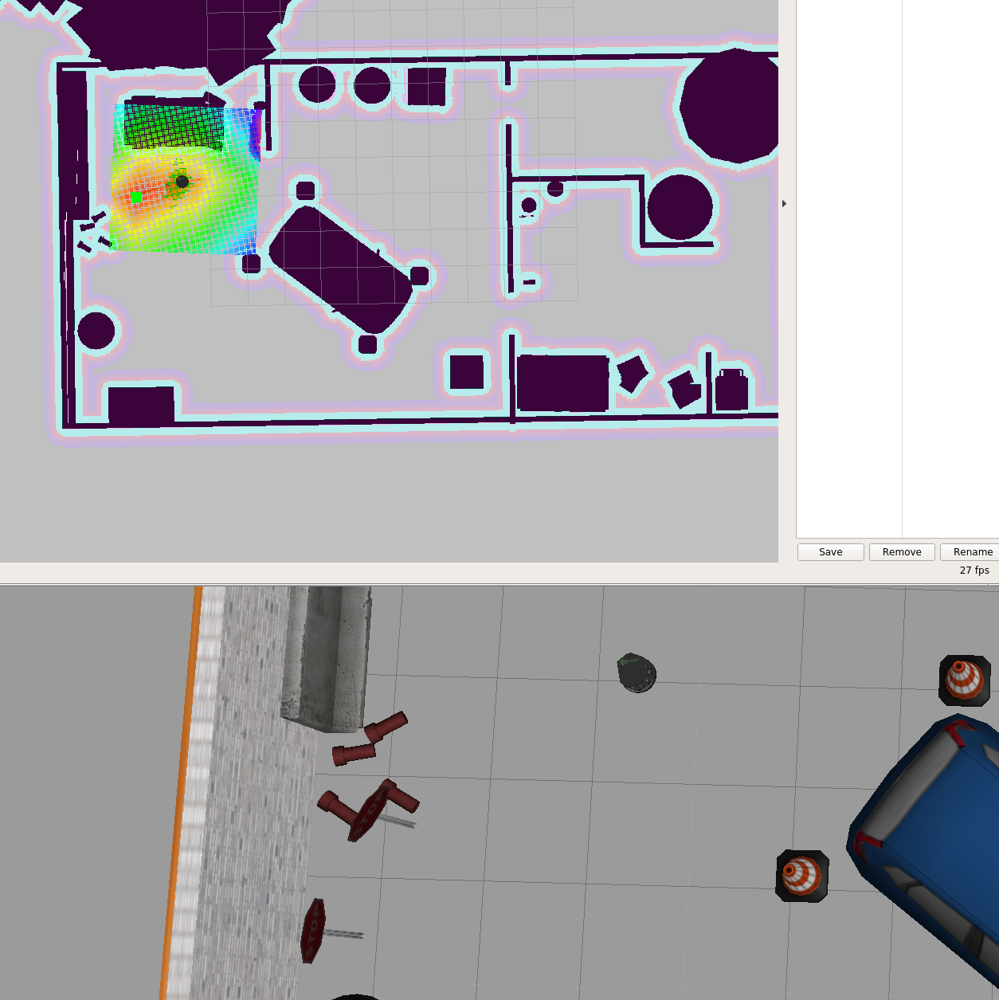
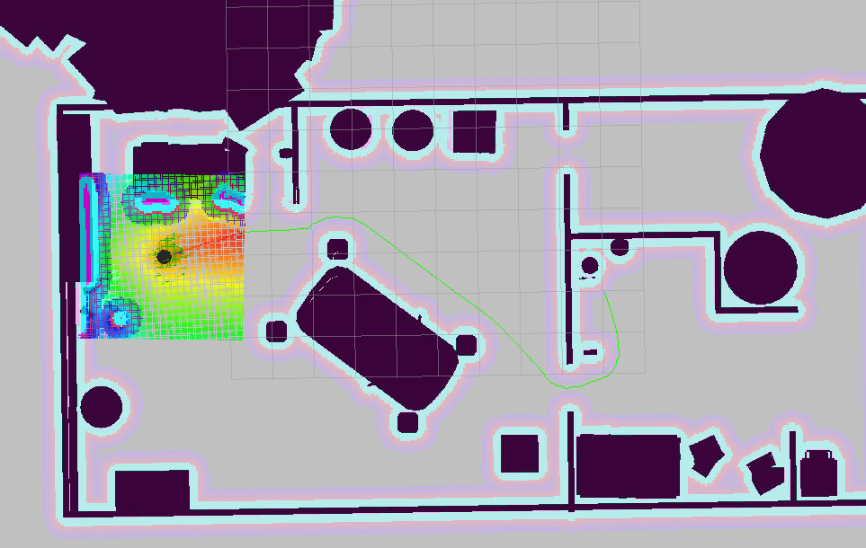
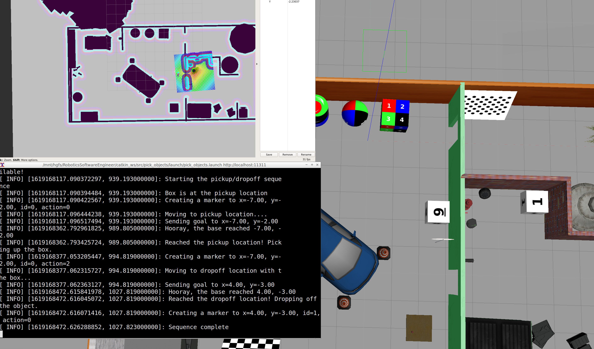

# Project 5

In this project, I use the turtlebot robot to pickup a virtual box and drop it off somewhere else. The robot uses adaptative monte carlo Localization to localize itself on a map. The map is created before hand and is updated as the measurements come in from the slam gmapping package. The robot thus performs SLAM (simultaneous localization and mapping) to localize itself in an environment.

# Installation

Install the following packages. A convenience script `scripts/setup.sh` will do this for you.

* Install the linux package `xterm`

* [gmapping](http://wiki.ros.org/gmapping): With the `gmapping_demo.launch` file, you can easily perform SLAM and build a map of the environment with a robot equipped with laser range finder sensors or RGB-D cameras.
* [turtlebot_teleop](http://wiki.ros.org/turtlebot_teleop): With the `keyboard_teleop.launch` file, you can manually control a robot using keyboard commands.
* [turtlebot_rviz_launchers](http://wiki.ros.org/turtlebot_rviz_launchers): With the `view_navigation.launch` file, you can load a preconfigured rviz workspace. You’ll save a lot of time by launching this file, because it will automatically load the robot model, trajectories, and map for you.
* [turtlebot_gazebo](http://wiki.ros.org/turtlebot_gazebo): With the `turtlebot_world.launch` you can deploy a turtlebot in a gazebo environment by linking the world file to it.

* Change the `CATKIN_SOURCE_BASH` variable in `scripts/helpers.sh` if your catkin devel folder is not one folder up from the scripts folder.

# Node description

## add_markers
This node creates a service that can receive "commands" to show or hide a marker in rviz. The commands contain the x,y,z position of the marker, its size (scale), a unique ID and the action to perform (hide=2, add=0).

## pick_objects
This node instructs the robot to go to the pickup location and then to the dropoff location. It uses ROS [navigation stack](http://wiki.ros.org/navigation/Tutorials/SendingSimpleGoals) that uses Dijkstra's algorithm to compute the path the robot should take while avoiding obstacles.

This node initially instructs the robot to move to the pickup location and publishes a message to the `add_markers` service to show the box at the pickup location. Once it reaches the pickup location, it waits there for 5 seconds, simulating the time the robot takes to pickup a virtual box. It then sends another message to the `add_markers` node to hide the box at the pickup location. The node then instructs the robot to move to the dropoff location. Once it reaches it, the virtual is shown in RVIZ by again sending another message to the `add_markers` node.

### Results

#### Picking up the box in rviz

#### Delivering the box in rviz

#### Dropping the box in rviz

# Scripts

* `setup.sh`: Downloads some of the dependencies needed to run this project.
* `helpers.sh`: Defines a series of utility functions used by the other scripts. This should not be run by itself.
* `test_slam.sh`: Deploys the turtlebot inside of the gazebo world, runs the SLAM gmapping node to perform localization and mapping, runs RVIZ to visualize the map as it gets created aswell as the robot's position. It also launches the keyboard teleop node which allows the robot to be controlled using the keyboard.
* `test_navigation.sh`: Same as `test_slam.sh`, but instead of guiding the robot using the keyboard, this launches the navigation stack to set a goal position the robot will navigate itself to using RVIZ.
* `pick_objects.sh`: This will launch the `pick_objects` node that will move to the pickup location and then to the dropoff location.
* `add_markers.sh`: This will launch the `add_markers` node that will show a marker at the pickup location, wait 5 seconds, then remove the marker at the pickup location, wait 5 seconds again and then show the marker at the dropoff location
* `home_service.sh`: This combines all of the above. It spawn the turtlebot inside the gazebo environment and start `rviz`, the `add_markers` node and the `pick_objects` node. It will:
  1. Show the box at the pickup location by sending a message to `add_markers`
  2. Instruct the robot to move to the pickup location
  3. Pickup the virtual box (takes 5 seconds)
  4. Hide the box in rviz by sending a hide message to `add_markers`
  5. Instruct the robot to move to the dropoff location
  6. Show the box in rviz at the dropoff location using a message to `add_markers`

## Creating the map
Generate the map from the Gazebo world directly using the ROS package [pgm_map_creator](https://github.com/udacity/pgm_map_creator)

The map ROS AMCL Package uses is a pgm file. A pgm file is a grayscale image file

By default, AMCL package will treat 'darker' pixels as obstacle in the pgm map file, and 'lighter' pixels as free space. The threshold could be set as a parameter which we will cover when we are building the launch file.

The map package needs `sudo apt-get install libignition-math2-dev protobuf-compiler`

Doing a git clone of `git clone https://github.com/udacity/pgm_map_creator.git` inside the catkin_ws and then copying the world to the `src/pgm_map_creator/world/`, and adding this line at the end of the world file, before `</world>`: `<plugin filename="libcollision_map_creator.so" name="collision_map_creator"/>` allows the plugin to generate the map.

Run `catkin_make` to build the project.

Then run `gzserver src/pgm_map_creator/world/<YOUR GAZEBO WORLD FILE>`

Then in a second terminal run `roslaunch pgm_map_creator request_publisher.launch`
